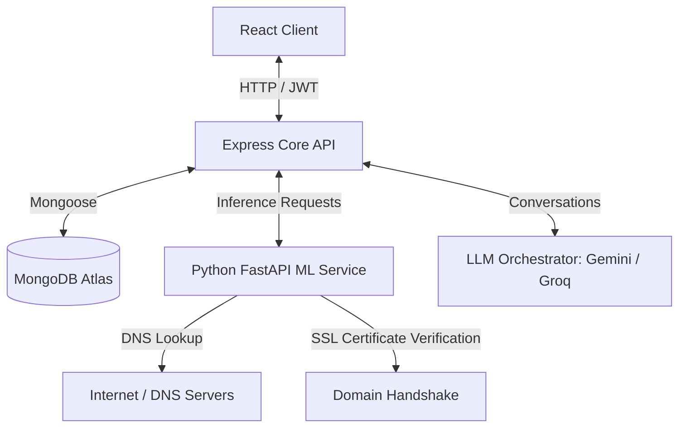

<div align="center">
  <h1>🛡️ TruPhish</h1>
  <p><strong>Advanced AI-Powered Phishing Detection & Threat Intelligence Platform</strong></p>

  <p>
    <a href="https://truphish.vercel.app/" target="_blank"></a>
    <a href="https://react.dev/" target="_blank"></a>
    <a href="https://nodejs.org/" target="_blank"></a>
    <a href="https://fastapi.tiangolo.com/" target="_blank"></a>
    <a href="https://www.mongodb.com/" target="_blank"></a>
  </p>
</div>

**TruPhish** is a modern, enterprise-ready full-stack application designed to proactively detect, analyze, and mitigate malicious phishing threats. By pairing a responsive and stunning React 19 single-page application with a high-throughput Express.js backend and a dedicated Python FastAPI machine learning service, TruPhish delivers real-time risk assessment for URLs, emails, and SMS messages.

---

## 🚀 Live Demo

Experience the live application hosted on Vercel:  
👉 **[https://truphish.vercel.app/](https://truphish.vercel.app/)**

---

## ✨ Key Features

- **🔍 Agentic URL Threat Scanner**: Sequentially resolves DNS, validates SSL/TLS certificate chains, analyzes brand impersonation, and runs URL path heuristic checks.
- **✉️ Text-Based Social Engineering Classifier**: Evaluates email and SMS body text to identify phishing vocabulary, urgency level, and credential requests.
- **💬 Secure AI Threat Analyst**: Integrates Gemini & Groq APIs to provide a context-aware security assistant that reviews scans, suggests countermeasures, and explains security implications.
- **📊 Real-time Analytical Visualizations**: Interactive threat-meter gauge, dynamic logs, and custom-styled responsive dashboard widgets.
- **🔒 JWT & Bcrypt Authentication**: End-to-end user identity protection with password hashing and session tracking.
- **🎨 Glassmorphism & LiquidEther UI**: Eye-catching dark/light visual style with modern fluid typography and premium animations.

---

## 🛠️ Tech Stack

### **Frontend**
* **React 19** & **Vite** for lightning-fast bundling.
* **LiquidEther WebGL** for custom fluid backdrops.
* **Recharts** for elegant data representation.
* **Lucide React** for clean, vector-based iconography.
* **React Router Dom** for client-side routing.

### **Backend (Core API)**
* **Node.js** & **Express.js** as the router and orchestrator.
* **MongoDB & Mongoose** for session persistence, history tracking, and user management.
* **JWT (JSON Web Tokens)** & **Bcrypt.js** for securing API endpoints.

### **ML & Threat Intel Service**
* **Python 3.10+** & **FastAPI** to execute high-performance analytical workers.
* **Uvicorn** ASGI server.
* **Socket / SSL / Whois Heuristics** for analyzing connection security and DNS states.

---

## 📂 Project Architecture



---

## ⚙️ Environment Variables

Before launching the project, configure the following environment parameters:

### **Backend (`/backend/.env`)**
```env
PORT=5000
MONGODB_URI=your_mongodb_connection_string
JWT_SECRET=your_jwt_signing_key
ML_API_URL=http://127.0.0.1:8000
GEMINI_API_KEY=your_gemini_api_key
GROQ_API_KEY=your_groq_api_key
```

---

## 🚀 Getting Started

### Prerequisites
* **Node.js** (v18.0.0+)
* **Python** (v3.10+)
* **MongoDB** (Local instance or MongoDB Atlas cluster)

---

### ⚡ One-Click Startup (Windows)

We provide a pre-configured PowerShell script that installs all dependencies, sets up the Python virtual environment (`venv`), and spawns all services simultaneously:

1. Clone the project:
   ```bash
   git clone https://github.com/santhiyaoffcl/TruPhish.git
   cd TruPhish
   ```
2. Run the startup script:
   ```powershell
   .\run_all.ps1
   ```

---

### 📦 Manual Setup

If you are on Linux/macOS or prefer manually booting each service:

#### 1. Start the FastAPI ML Service
```bash
cd ml-service
python -m venv venv
source venv/bin/activate  # On Windows use: .\venv\Scripts\Activate.ps1
pip install -r requirements.txt
python app.py
```
*The service will start listening on `http://localhost:8000`.*

#### 2. Start the Express Backend API
```bash
cd backend
npm install
npm run dev
```
*The API will start listening on `http://localhost:5000`.*

#### 3. Start the React Frontend Console
```bash
cd frontend
npm install
npm run dev
```
*The local development server will start on `http://localhost:5173`.*

---

## 🛡️ Security & Privacy
TruPhish prioritizes privacy. No raw scanned URLs or text values are logged to public search interfaces, and all user credentials undergo one-way cryptographic hashing before database storage.

## 🤝 Contributing
Contributions are what make the open source community such an amazing place to learn, inspire, and create. Any contributions you make are **greatly appreciated**.

1. Fork the Project
2. Create your Feature Branch (`git checkout -b feature/AmazingFeature`)
3. Commit your Changes (`git commit -m 'Add some AmazingFeature'`)
4. Push to the Branch (`git push origin feature/AmazingFeature`)
5. Open a Pull Request

## 📝 License
Distributed under the **ISC License**. See the `LICENSE` files for more details.
